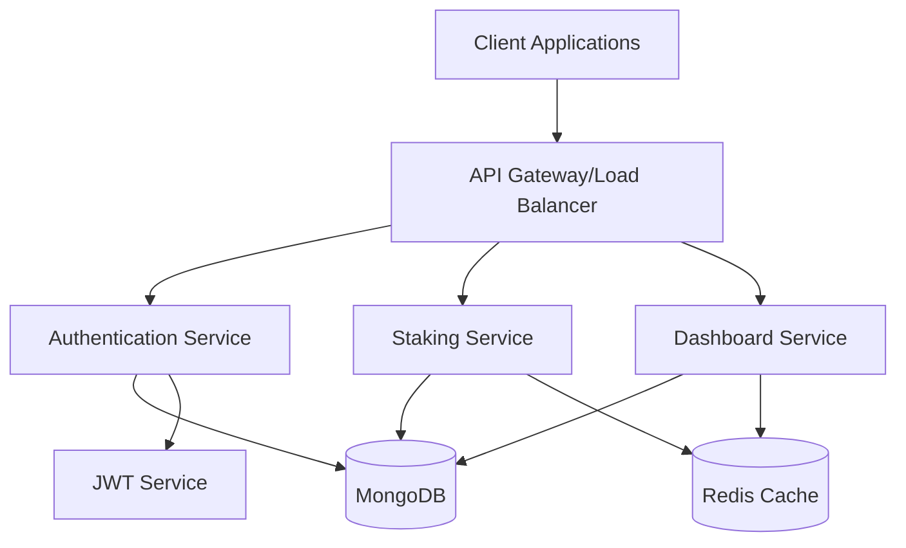
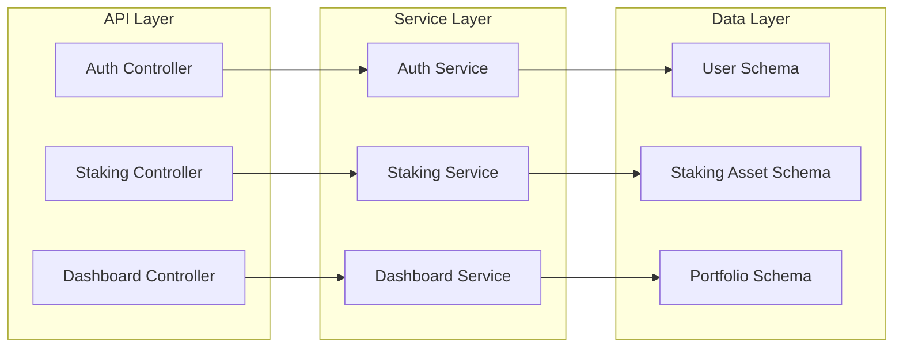
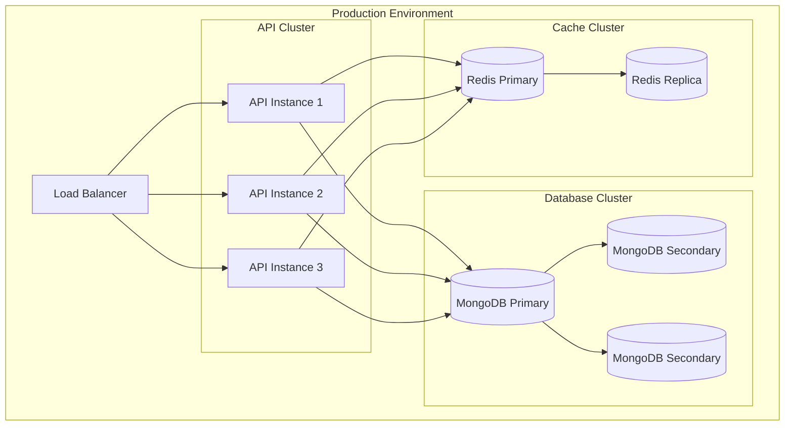

# Software Requirements Specification (SRS)
# Staking Dashboard API

## 1. Introduction

### 1.1 Purpose
This document provides a detailed specification of requirements for the Staking Dashboard API, a NestJS-based backend service that manages cryptocurrency staking operations, user portfolios, and performance metrics.

### 1.2 Scope
The system provides a comprehensive API for managing staking operations, user authentication, portfolio tracking, and performance analytics for cryptocurrency staking activities.

## 2. System Architecture

### 2.1 High-Level Architecture



### 2.2 Component Architecture



## 3. Functional Requirements

### 3.1 Authentication Module
1. User Registration
   - Accept email, password, and wallet address
   - Validate input data
   - Hash passwords securely
   - Store user data in MongoDB
   - Return JWT token

2. User Authentication
   - Implement JWT-based authentication
   - Token expiration after 24 hours
   - Refresh token mechanism
   - Role-based access control

### 3.2 Staking Module
1. Asset Management
   - List available staking assets
   - Track reward rates
   - Monitor staking ratios
   - Calculate returns

2. Portfolio Management
   - Track user stakes
   - Calculate total value
   - Monitor performance
   - Historical data tracking

### 3.3 Dashboard Module
1. Performance Metrics
   - Total portfolio value
   - Asset distribution
   - ROI calculations
   - Historical performance

2. Analytics
   - Reward rate trends
   - Asset performance comparison
   - Risk metrics
   - Market data integration

## 4. Non-Functional Requirements

### 4.1 Performance
- API response time < 200ms
- Support 1000 concurrent users
- 99.9% uptime
- Cache hit ratio > 80%

### 4.2 Security
- HTTPS encryption
- JWT token encryption
- Rate limiting
- Input validation
- XSS protection
- CORS policy

### 4.3 Scalability
- Horizontal scaling capability
- Load balancing support
- Database sharding ready
- Microservices architecture

### 4.4 Caching
- 5-minute TTL for most endpoints
- Redis cache implementation
- Cache invalidation strategy
- Cache warming mechanism

## 5. Data Models

### 5.1 User Schema
```typescript
{
  email: string;
  password: string;
  walletAddress: string;
  roles: string[];
  isVerified: boolean;
  createdAt: Date;
  updatedAt: Date;
}
```

### 5.2 Staking Asset Schema
```typescript
{
  symbol: string;
  name: string;
  type: string;
  currentRewardRate: number;
  priceUsd: number;
  stakingRatio: number;
  minimumStake: number;
  updatedAt: Date;
}
```

### 5.3 Portfolio Schema
```typescript
{
  userId: string;
  walletAddress: string;
  assets: [{
    assetId: string;
    amount: number;
    stakedAmount: number;
    startDate: Date;
    rewardRate: number;
  }];
  totalValue: number;
  updatedAt: Date;
}
```

## 6. API Endpoints Structure

This can be found in the SETUP.md file in the root of the repo

## 7. Technical Stack

### 7.1 Core Technologies
- NestJS (Backend Framework)
- MongoDB (Database)
- Nodecache (Caching)
- JWT (Authentication)
- TypeScript (Language)

### 7.2 Development Tools
- pnpm (Package Manager)
- Jest (Testing)
- ESLint (Linting)
- Prettier (Code Formatting)
- Git (Version Control)

## 8. Deployment Architecture



## 9. Monitoring and Logging

### 9.1 Metrics to Monitor
- API response times
- Error rates
- Cache hit/miss ratio
- Database performance
- System resources

### 9.2 Logging Requirements
- Request/Response logging
- Error logging
- Performance metrics
- Audit trails
- Security events

## 10. Testing Strategy

### 10.1 Testing Levels
1. Unit Testing
   - Service methods
   - Controllers
   - Utilities

2. Integration Testing
   - API endpoints
   - Database operations
   - Cache operations

3. Performance Testing
   - Load testing
   - Stress testing
   - Endurance testing

### 10.2 Test Coverage Requirements
- Minimum 80% code coverage
- Critical paths 100% covered
- Error scenarios tested
- Edge cases handled